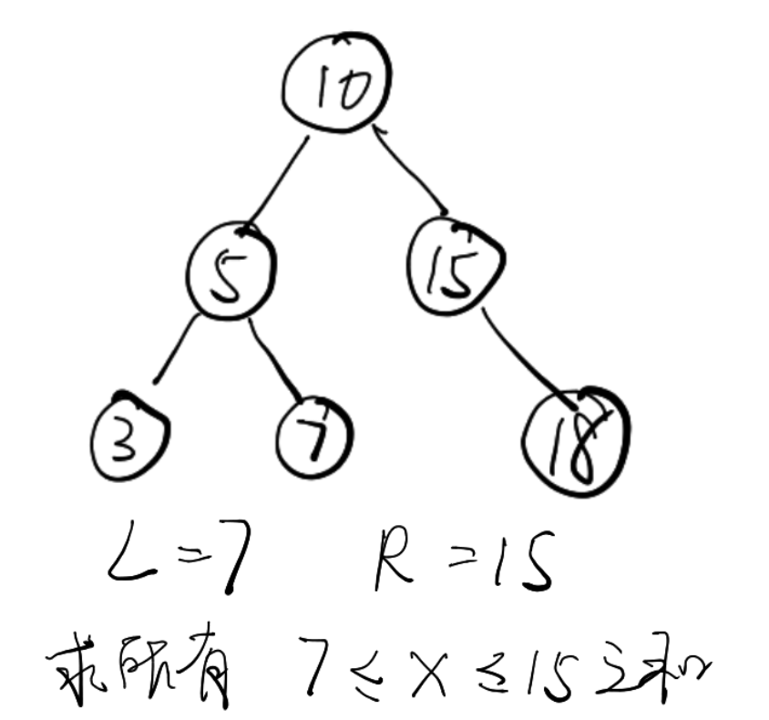
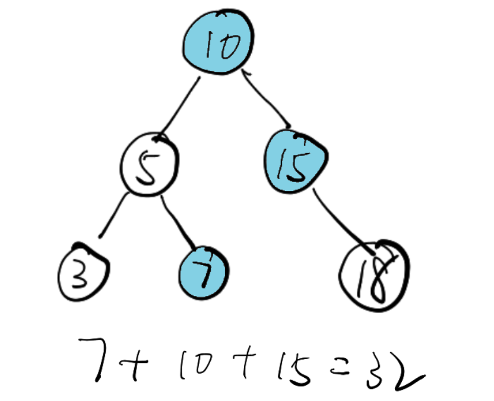

> https://leetcode.com/problems/range-sum-of-bst/

## Desc

Given the `root` listNode of a binary search tree, return the sum of values of all nodes with value between `L` and `R`(inclusive).

The binary search tree is guaranteed to have unique values.

**Example 1:**

```
Input: root = [10,5,15,3,7,null,18], L = 7, R = 15
Output: 32
```

**Example 2:**

```
Input: root = [10,5,15,3,7,13,18,1,null,6], L = 6, R = 10
Output: 23
```

**Note:**

1. The number of nodes in the tree is at most `10000`.
2. The final answer is guaranteed to be less than `2^31`.


## 描述

给定二叉搜索树的根结点 root，返回 L 和 R（含）之间的所有结点的值的和。

二叉搜索树保证具有唯一的值。

示例 1：

```
输入：root = [10,5,15,3,7,null,18], L = 7, R = 15
输出：32
```
示例 2：
```
输入：root = [10,5,15,3,7,13,18,1,null,6], L = 6, R = 10
输出：23
```


## 理解

以示例1为例






可以用递归理解一下,我拿到一个节点,如果这个节点的值在L-R之间,我就加到结果里,  
如果这个值比L大,说明他的左子树里可能有我需要的,我去搜索左子树.  
如果比R小,说明它的右子树里可能有我需要的,我去搜索右子树.  
最后的基线条件/终止条件就是,拿到的节点为null   


```java
package leetcode.tree.BST;

import leetcode.tree.TreeNode;

public class RangeSumOfBST {

    int res = 0;
    public int rangeSumBST(TreeNode root, int L, int R) {

        search(root,L,R);
        return res;

    }

    public void search(TreeNode root, int L, int R) {
        if(root==null){
            return;
        }
        if(root.val>=L && root.val<=R ){
            res+=root.val;
        }

        //如果这个值比L大,说明他的左子树里可能有我需要的,我去搜索左子树,
        if(root.val >L){
            search(root.left,L,R);
        }
        //如果这个值比R小,说明他的右子树里可能有我需要的,我去搜索右子树,
        if(root.val <R){
            search(root.right,L,R);
        }

    }
}

```


