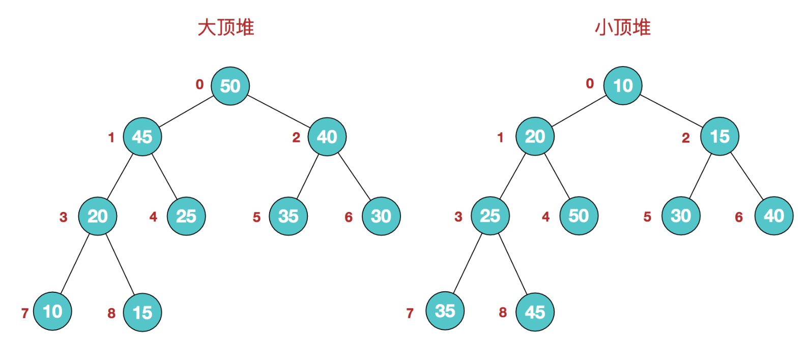
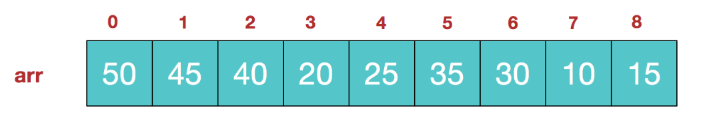
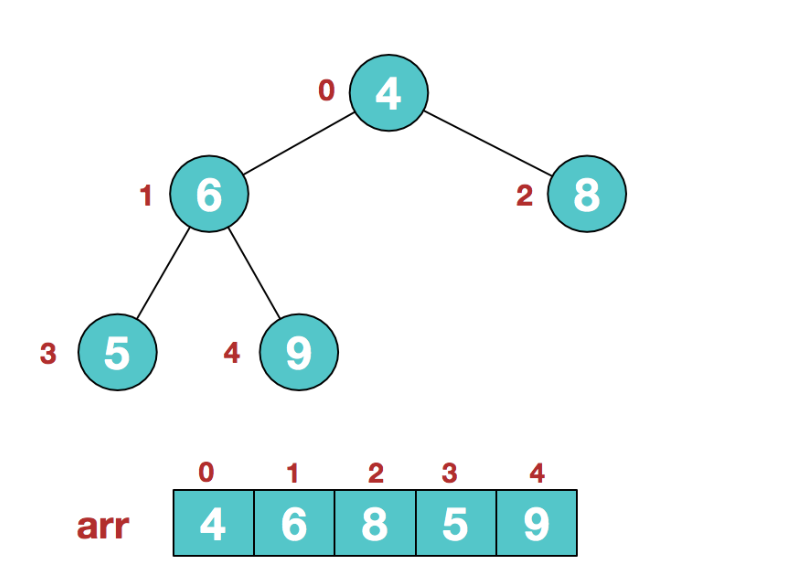
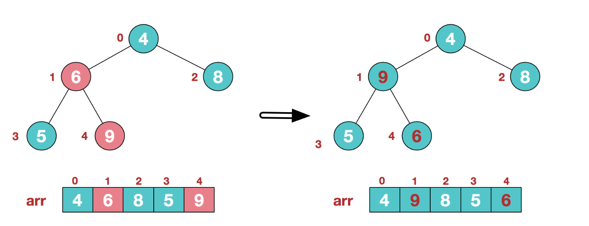
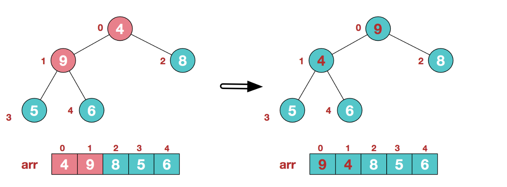
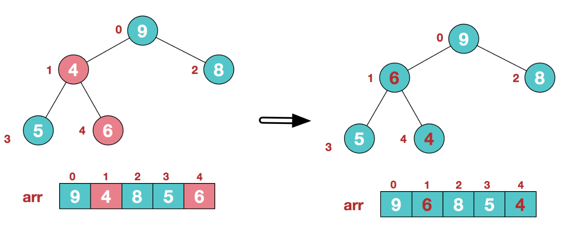
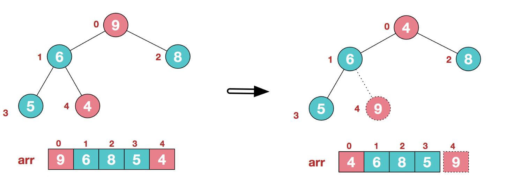
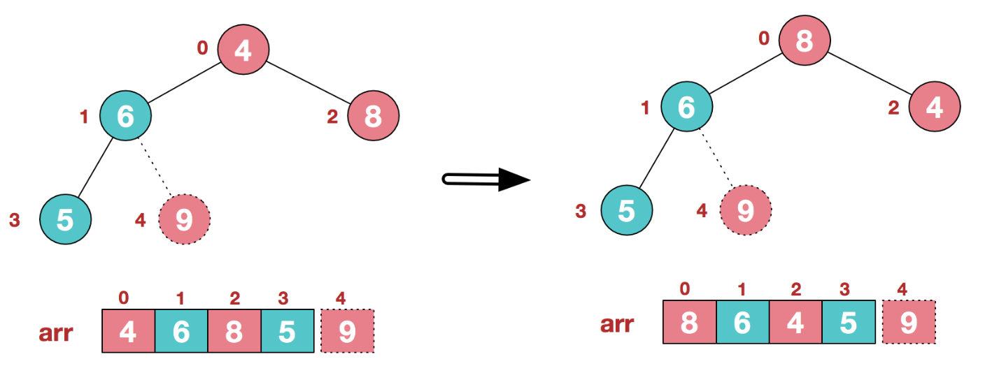
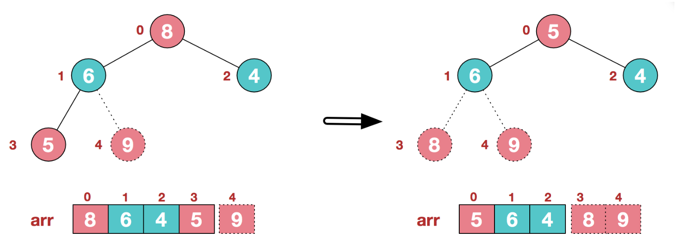
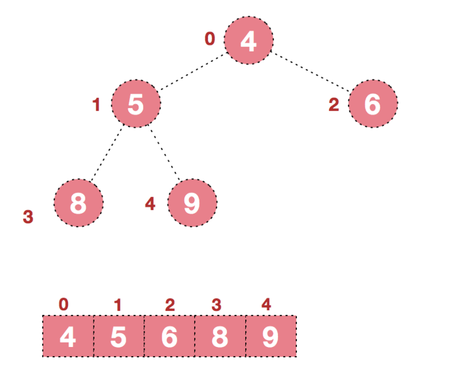

# 堆排序

## 选择排序

选择排序（Selection Sort）是一种简单直观的排序算法。它的工作原理如下，首先在未排序序列中找到最小（大）元素，存放到排序序列的起始位置，然后，再从剩余未排序元素中继续寻找最小（大）元素，然后放到已排序序列的末尾。以此类推，直到所有元素均排序完毕。

O(N^2)

```java
void selectionSort (Elementtype A [], int N){
    for(int i=0; iくN;i++){
      /*从 A[i]到 A[N-1] 中找最小元，并将其位置赋给 minPosition*/
      int minPosition = scanForMin(A,i,N-1);
      /*将未排序部分的最小元换到有序部分的最后位置*/
      swap(A[i],A[MinPosition]);
    }
  
} 
```

可以看出,选择排序的时间复杂度是O(N^2),如何能把选择排序变快?

如何快速找到最小元?

## 堆排序

堆排序是利用**堆**这种数据结构而设计的一种排序算法，堆排序是一种**选择排序，**它的最坏，最好，平均时间复杂度均为O(nlogn)

### 堆

**堆是具有以下性质的完全二叉树：每个结点的值都大于或等于其左右孩子结点的值，称为大顶堆；或者每个结点的值都小于或等于其左右孩子结点的值，称为小顶堆。**



同时，我们对堆中的结点按层进行编号，将这种逻辑结构映射到数组中就是下面这个样子



该数组从逻辑上讲就是一个堆结构，我们用简单的公式来描述一下堆的定义就是：

**大顶堆：arr[i] >= arr[2i+1] && arr[i] >= arr[2i+2]**  

**小顶堆：arr[i] <= arr[2i+1] && arr[i] <= arr[2i+2]**  

> 一个结点的两个子节点的index是2i+1和2i+2


### 堆排序思想

**堆排序的基本思想是：将待排序序列构造成一个大顶堆，此时，整个序列的最大值就是堆顶的根节点。将其与末尾元素进行交换，此时末尾就为最大值。然后将剩余n-1个元素重新构造成一个堆，这样会得到n个元素的次小值。如此反复执行，便能得到一个有序序列了**

#### 步骤一:构造初始堆。

将给定无序序列构造成一个大顶堆（一般升序采用大顶堆，降序采用小顶堆)。



此时我们从最后一个非叶子结点开始（叶结点自然不用调整，第一个非叶子结点 arr.length/2-1=5/2-1=1，也就是下面的6结点），从左至右，从下至上进行调整。

> 子节点i的父节点在位置floor((i-1)/2)  =(array.length -2)/2 . 也可以写成array.length/2-1



找到第二个非叶节点4，由于[4,9,8]中9元素最大，4和9交换。



这时，交换导致了子根[4,5,6]结构混乱，继续调整，[4,5,6]中6最大，交换4和6。



此时，我们就将一个无需序列构造成了一个大顶堆。

#### 步骤二:将堆顶元素与末尾元素进行交换，使末尾元素最大。然后继续调整堆

将堆顶元素9和末尾元素4进行交换



重新调整结构，使其继续满足堆定义



再将堆顶元素8与末尾元素5进行交换，得到第二大元素8.




后续过程，继续进行调整，交换，如此反复进行，最终使得整个序列有序



再简单总结下堆排序的基本思路：

　　**a.将无需序列构建成一个堆，根据升序降序需求选择大顶堆或小顶堆;**

　　**b.将堆顶元素与末尾元素交换，将最大元素"沉"到数组末端;**

　　**c.重新调整结构，使其满足堆定义，然后继续交换堆顶元素与当前末尾元素，反复执行调整+交换步骤，直到整个序列有序。**

### 堆排序实现

堆排序其实算是对选择排序的一种改进.

```java
/**
* 下沉调整
* @param array     待调整的堆
* @param parentIndex    要下沉的父节点
* @param parentIndex    堆的有效大小
*/
public static void downAdjust(int[] array, int parentIndex, int length) {
   // temp保存父节点值，用于最后的赋值
   int temp = array[parentIndex];
   int childIndex = 2 * parentIndex + 1;
   while (childIndex < length) {
       // 如果有右孩子，且右孩子大于左孩子的值，则定位到右孩子
       if (childIndex + 1 < length && array[childIndex + 1] > array[childIndex]) {
           childIndex++;
       }
       // 如果父节点小于任何一个孩子的值，直接跳出
       if (temp >= array[childIndex])
           break;
       //无需真正交换，单向赋值即可
       array[parentIndex] = array[childIndex];
       parentIndex = childIndex;
       childIndex = 2 * childIndex + 1;
   }
   array[parentIndex] = temp;
}
```


```java
/**
* 堆排序
* @param array     待调整的堆
*/
public static void heapSort(int[] array) {
   // 1.把无序数组构建成二叉堆。
   for (int i = (array.length)/2; i >= 0; i--) {
       downAdjust(array, i, array.length-1);
   }
   System.out.println(Arrays.toString(array));
   // 2.循环删除堆顶元素，移到集合尾部，调节堆产生新的堆顶。
   for (int i = array.length - 1; i > 0; i--) {
       // 最后一个元素和第一元素进行交换
       int temp = array[i];
       array[i] = array[0];
       array[0] = temp;
       // 下沉调整最大堆
       downAdjust(array, 0, i);
   }
}
 
```


```java
public static void main(String[] args) {
   int[] arr = new int[] {1,3,2,6,5,7,8,9,10,0};
   heapSort(arr);
   System.out.println(Arrays.toString(arr));
}
```

