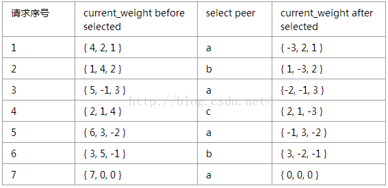

## 存储方式

```java
public class IpMap
{
    // 待路由的Ip列表，Key代表Ip，Value代表该Ip的权重
    public static HashMap<String, Integer> serverWeightMap = 
            new HashMap<String, Integer>();
    
    static
    {
        serverWeightMap.put("192.168.1.100", 1);
        serverWeightMap.put("192.168.1.101", 1);
        // 权重为4
        serverWeightMap.put("192.168.1.102", 4);
        serverWeightMap.put("192.168.1.103", 1);
        serverWeightMap.put("192.168.1.104", 1);
        // 权重为3
        serverWeightMap.put("192.168.1.105", 3);
        serverWeightMap.put("192.168.1.106", 1);
        // 权重为2
        serverWeightMap.put("192.168.1.107", 2);
        serverWeightMap.put("192.168.1.108", 1);
        serverWeightMap.put("192.168.1.109", 1);
        serverWeightMap.put("192.168.1.110", 1);
    }
}
```


## 轮询法--**Round-Robin**

轮询算法是最简单的一种负载均衡算法。它的原理是把来自用户的请求轮流分配给内部的服务器：从服务器1开始，直到服务器N，然后重新开始循环。

算法的优点是其简洁性，它无需记录当前所有连接的状态，所以它是一种无状态调度。这种算法会使每台服务器处理的请求是相同的，所以适合用于服务器硬件条件基本都相同的场景。


```java
public class RoundRobin
{
    private static Integer pos = 0;
    
    public static String getServer()
    {
        // 重建一个Map，避免服务器的上下线导致的并发问题
        Map<String, Integer> serverMap = 
                new HashMap<String, Integer>();
        serverMap.putAll(IpMap.serverWeightMap);
        
        // 取得Ip地址List
        Set<String> keySet = serverMap.keySet();
        ArrayList<String> keyList = new ArrayList<String>();
        keyList.addAll(keySet);
        
        String server = null;
        // 注意加锁
        synchronized (pos)
        {
            if (pos > keySet.size())
                pos = 0;
            server = keyList.get(pos);
            pos ++;
        }
        
        return server;
    }
}
```


## 加权轮询算法--Weighted Round-Robin

轮询算法并没有考虑每台服务器的处理能力，实际中可能并不是这种情况。由于每台服务器的配置、安装的业务应用等不同，其处理能力会不一样。所以，加权轮询算法的原理就是：根据服务器的不同处理能力，给每个服务器分配不同的权值，使其能够接受相应权值数的服务请求。

本质是生成一个序列,当然这个序列可能是不均匀的,比如`[a,a,a,a,b,c]`,可以稍微resort一下.

```java
public class WeightRoundRobin
{
    private static Integer pos;
    
    public static String getServer()
    {
        // 重建一个Map，避免服务器的上下线导致的并发问题
        Map<String, Integer> serverMap = 
                new HashMap<String, Integer>();
        serverMap.putAll(IpMap.serverWeightMap);
        
        // 取得Ip地址List
        Set<String> keySet = serverMap.keySet();
        Iterator<String> iterator = keySet.iterator();
        
        List<String> serverList = new ArrayList<String>();
        while (iterator.hasNext())
        {
            String server = iterator.next();
            int weight = serverMap.get(server);
            for (int i = 0; i < weight; i++)
                serverList.add(server);
        }
        
        String server = null;
        synchronized (pos)
        {
            if (pos > keySet.size())
                pos = 0;
            server = serverList.get(pos);
            pos ++;
        }
        
        return server;
    }
}
```

### 平滑的加权轮询

在Nginx源码中，实现了一种叫做平滑的加权轮询（smooth weighted round-robin balancing）的算法，它生成的序列更加均匀。比如前面的例子，它生成的序列为{ a, a, b, a, c, a, a}，转发给后端a的5个请求现在分散开来，不再是连续的。

该算法的原理如下：

　　每个服务器都有两个权重变量：

　　a：weight，配置文件中指定的该服务器的权重，这个值是固定不变的；

　　b：current_weight，服务器目前的权重。一开始为0，之后会动态调整。

- 　每次当请求到来，选取服务器时，会遍历数组中所有服务器。对于每个服务器，让它的current_weight增加它的weight；同时累加所有服务器的weight，并保存为total。

- 　遍历完所有服务器之后，如果该服务器的current_weight是最大的，就选择这个服务器处理本次请求。最后把该服务器的current_weight减去total。

按照这个配置，每7个客户端请求中，a会被选中4次、b会被选中2次、c会被选中1次，且分布平滑。我们来算算看是不是这样子的。

 initial  current_weight  of a, b, c is {0, 0, 0}



通过上述过程，可得以下结论：

　　a：7个请求中，a、b、c分别被选取了4、2、1次，符合它们的权重值。

　　b：7个请求中，a、b、c被选取的顺序为a, b,a, c, a, b, a，分布均匀，权重大的后端a没有被连续选取。

　　c：每经过7个请求后，a、b、c的current_weight又回到初始值{0, 0,0}，因此上述流程是不断循环的。


## 随机算法


通过系统随机函数，根据后端服务器列表的大小值来随机选择其中一台进行访问。由概率统计理论可以得知，随着调用量的增大，其实际效果越来越接近于平均分配流量到每一台后端服务器，也就是轮询的效果。

随机法的代码实现大致如下：

```java
public class Random
{
    public static String getServer()
    {
        // 重建一个Map，避免服务器的上下线导致的并发问题
        Map<String, Integer> serverMap = 
                new HashMap<String, Integer>();
        serverMap.putAll(IpMap.serverWeightMap);
        
        // 取得Ip地址List
        Set<String> keySet = serverMap.keySet();
        ArrayList<String> keyList = new ArrayList<String>();
        keyList.addAll(keySet);
        
        java.util.Random random = new java.util.Random();
        int randomPos = random.nextInt(keyList.size());
        
        return keyList.get(randomPos);
    }
}
```

整体代码思路和轮询法一致，先重建serverMap，再获取到server列表。在选取server的时候，通过Random的nextInt方法取0~keyList.size()区间的一个随机值，从而从服务器列表中随机获取到一台服务器地址进行返回。**基于概率统计的理论，吞吐量越大，随机算法的效果越接近于轮询算法的效果**。


## 加权随机算法

随机，按权重设置随机概率。

与加权轮询法类似，加权随机法也是根据后端服务器不同的配置和负载情况来配置不同的权重。不同的是，它是按照权重来随机选择服务器的，而不是顺序。加权随机法的代码实现如下

本质还是序列.

```java
public class WeightRandom
{
    public static String getServer()
    {
        // 重建一个Map，避免服务器的上下线导致的并发问题
        Map<String, Integer> serverMap = 
                new HashMap<String, Integer>();
        serverMap.putAll(IpMap.serverWeightMap);
        
        // 取得Ip地址List
        Set<String> keySet = serverMap.keySet();
        Iterator<String> iterator = keySet.iterator();
        
        List<String> serverList = new ArrayList<String>();
        while (iterator.hasNext())
        {
            String server = iterator.next();
            int weight = serverMap.get(server);
            for (int i = 0; i < weight; i++)
                serverList.add(server);
        }
        
        java.util.Random random = new java.util.Random();
        int randomPos = random.nextInt(serverList.size());
        
        return serverList.get(randomPos);
    }
}
```


## 一致性hash均衡算法

源地址哈希的思想是获取客户端访问的IP地址值，通过哈希函数计算得到一个数值，用该数值对服务器列表的大小进行取模运算，得到的结果便是要访问的服务器的序号。

```java
public class Hash
{
    public static String getServer()
    {
        // 重建一个Map，避免服务器的上下线导致的并发问题
        Map<String, Integer> serverMap = 
                new HashMap<String, Integer>();
        serverMap.putAll(IpMap.serverWeightMap);
        
        // 取得Ip地址List
        Set<String> keySet = serverMap.keySet();
        ArrayList<String> keyList = new ArrayList<String>();
        keyList.addAll(keySet);
        
        // 在Web应用中可通过HttpServlet的getRemoteIp方法获取
        String remoteIp = "127.0.0.1";
        int hashCode = remoteIp.hashCode();
        int serverListSize = keyList.size();
        int serverPos = hashCode % serverListSize;
        
        return keyList.get(serverPos);
    }
}
```

**源地址哈希法的优点在于：** **保证了相同客户端IP地址将会被哈希到同一台后端服务器，直到后端服务器列表变更。根据此特性可以在服务消费者与服务提供者之间建立有状态的session会话**。

**源地址哈希算法的缺点在于：除非集群中服务器的非常稳定，基本不会上下线，否则一旦有服务器上线、下线，那么通过源地址哈希算法路由到的服务器是服务器上线、下线前路由到的服务器的概率非常低，如果是session则取不到session，如果是缓存则可能引发"雪崩"**。


## 最少活跃调用数均衡算法--**Least Action Load Balance**

最少活跃调用数，相同活跃数的随机，活跃数指调用前后计数差。

使慢的提供者收到更少请求，因为越慢的提供者的调用前后技术差会越大。