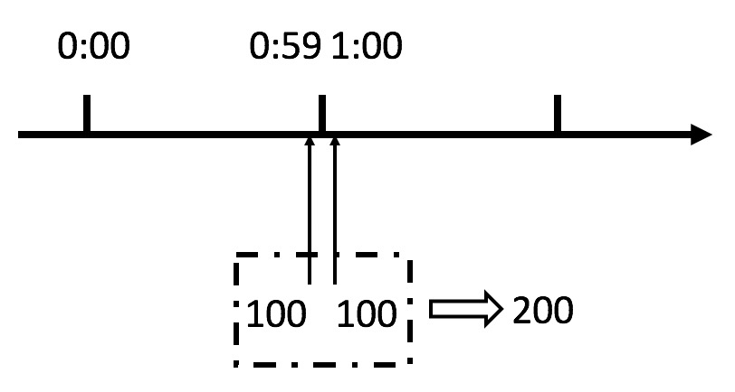
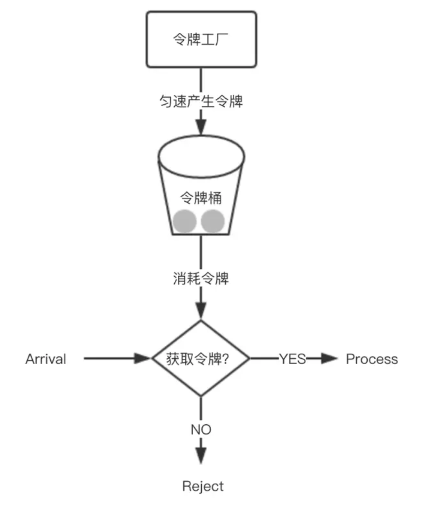

## 计数器法

计数器算法是限流算法里最简单也是最容易实现的一种算法。比如我们规定，对于A接口来说，我们1分钟的访问次数不能超过100个。那么我们可以这么做：在一开 始的时候，我们可以设置一个计数器counter，每当一个请求过来的时候，counter就加1，如果counter的值大于100并且该请求与第一个 请求的间隔时间还在1分钟之内，那么说明请求数过多；如果该请求与第一个请求的间隔时间大于1分钟，且counter的值还在限流范围内，那么就重置 counter，具体算法的示意图如下：


这个算法虽然简单，但是有一个十分致命的问题，那就是临界问题，我们看下图：



从上图中我们可以看到，假设有一个恶意用户，他在0:59时，瞬间发送了100个请求，并且1:00又瞬间发送了100个请求，那么其实这个用户在 1秒里面，瞬间发送了200个请求。我们刚才规定的是1分钟最多100个请求，也就是每秒钟最多1.7个请求，用户通过在时间窗口的重置节点处突发请求， 可以瞬间超过我们的速率限制。用户有可能通过算法的这个漏洞，瞬间压垮我们的应用。

这个问题实际是因为统计的精度太低.


## 滑动窗口

rolling window

更细分统计时间维度

## 漏桶算法

类似生活用到的漏斗，当请求进来时，相当于水倒入漏斗，然后从下端小口慢慢匀速的流出。不管上面流量多大，下面流出的速度始终保持不变。

不管服务调用方多么不稳定，通过漏桶算法进行限流，每10毫秒处理一次请求。因为处理的速度是固定的，请求进来的速度是未知的，可能突然进来很多请求，没来得及处理的请求就先放在桶里，既然是个桶，肯定是有容量上限，如果桶满了，那么新进来的请求就丢弃。


`漏桶算法`比较简单，但却不能应对实际场景，比如瞬间突然暴增的流量。

## 令牌桶算法

### 介绍

从某种意义上讲，令牌桶算法是对漏桶算法的一种改进，漏桶算法能够限制请求调用的速率，而令牌桶算法能够在限制调用的平均速率的同时还允许一定程度的突发调用。

在令牌桶算法中，存在一个桶，用来存放固定数量的令牌。算法中存在一种机制，以一定的速率往桶中放令牌。每次请求调用需要先获取令牌，只有拿到令牌，才有机会继续执行，否则选择选择等待可用的令牌、或者直接拒绝。

放令牌这个动作是持续不断的进行，如果桶中令牌数达到上限，就丢弃令牌，所以就存在这种情况，桶中一直有大量的可用令牌，这时进来的请求就可以直接拿到令牌执行，比如设置qps为100，那么限流器初始化完成一秒后，桶中就已经有100个令牌了，这时服务还没完全启动好，等启动完成对外提供服务时，该限流器可以抵挡瞬时的100个请求。所以，只有桶中没有令牌时，请求才会进行等待，最后相当于以一定的速率执行。




### 实现

可以准备一个队列，用来保存令牌，另外通过一个线程池定期生成令牌放到队列中，每来一个请求，就从队列中获取一个令牌，并继续执行。

通过Google开源的guava包，我们可以很轻松的创建一个令牌桶算法的限流器。

```xml
 <dependency>
    <groupId>com.google.guava</groupId>
    <artifactId>guava</artifactId>
    <version>18.0</version>
</dependency>
```

通过RateLimiter类的create方法，创建限流器。

```java
public class RateLimiterMain {
    public static void main(String[] args) {
        RateLimiter rateLimiter = RateLimiter.create(10);
        for (int i = 0; i < 10; i++) {
            new Thread(new Runnable() {
                @Override
                public void run() {
                    rateLimiter.acquire()
                    System.out.println("pass");
                }
            }).start();
        }
    }
}
```


其实Guava提供了多种create方法，方便创建适合各种需求的限流器。在上述例子中，创建了一个每秒生成10个令牌的限流器，即100ms生成一个，并最多保存10个令牌，多余的会被丢弃。

rateLimiter提供了acquire()和tryAcquire()接口
1、使用acquire()方法，如果没有可用令牌，会一直阻塞直到有足够的令牌。
2、使用tryAcquire()方法，如果没有可用令牌，就直接返回false。
3、使用tryAcquire()带超时时间的方法，如果没有可用令牌，就会判断在超时时间内是否可以等到令牌，如果不能，就返回false，如果可以，就阻塞等待。


## 分布式限流

前面讨论的几种算法都属于单机限流的范畴，但是业务需求五花八门，简单的单机限流，根本无法满足他们。

比如为了限制某个资源被每个用户或者商户的访问次数，5s只能访问2次，或者一天只能调用1000次，这种需求，单机限流是无法实现的，这时就需要通过集群限流进行实现。

**如何实现？**
为了控制访问次数，肯定需要一个计数器，而且这个计数器只能保存在第三方服务，比如redis。

大概思路：每次有相关操作的时候，就向redis服务器发送一个incr命令，比如需要限制某个用户访问/index接口的次数，只需要拼接用户id和接口名生成redis的key，每次该用户访问此接口时，只需要对这个key执行incr命令，在这个key带上过期时间，就可以实现指定时间的访问频率。

