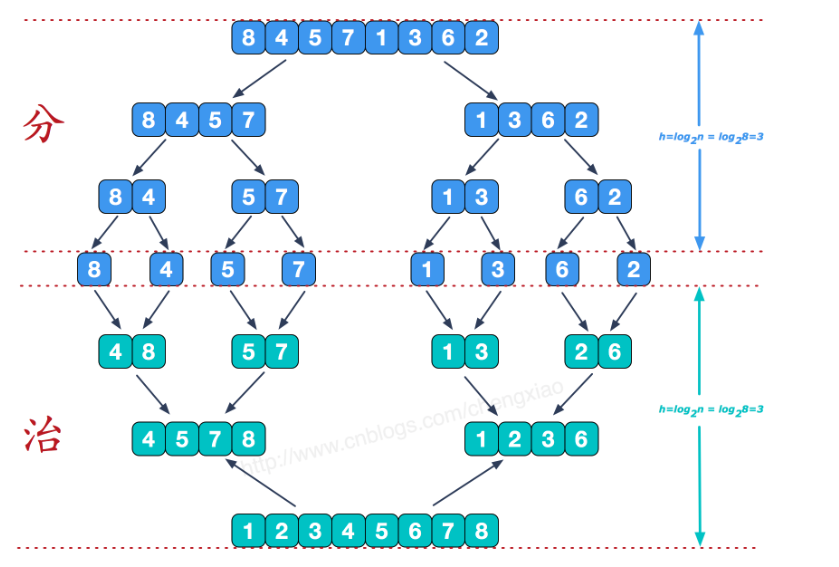
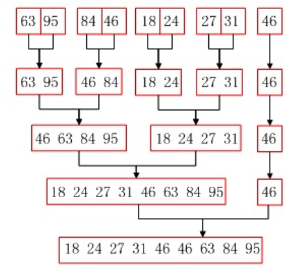

## 归并排序


## 思路

归并排序（MERGE-SORT）是利用**归并**的思想实现的排序方法，该算法采用经典的**分治**（divide-and-conquer）策略（分治法将问题**分**(divide)成一些小的问题然后递归求解，而**治(conquer)**的阶段则将分的阶段得到的各答案"修补"在一起，即分而治之)。






## 实现

```java
class MergeSort {


    public static void main(String[] args) {
        int[] nums = new int[]{1, 14, 5869, 2, -1, 88, 9, 9, 3};
        int[] temp = new int[nums.length];
        new MergeSort().mergeSort(nums, 0, nums.length - 1, temp);

        // break point
        System.out.print("");

    }

    void mergeSort(int[] nums, int start, int end, int[] temp) {
        if (start < end) {
            int mid = start + (end - start) / 2;
            // 先分
            mergeSort(nums, start, mid, temp);
            mergeSort(nums, mid + 1, end, temp);
            
            //然后合并
            mergeArray(nums, start, mid, end, temp);

        }


    }
  
  public static void mergeSortNoRecursion(int[] arr, int start, int end, int[] temp)    {


        // 从 1开始分割，与递归不同的是，递归由数组长度一分为二最后到1，
        // 而非递归则是从1开始扩大二倍直到数组长度
        int step = 1;

        while (step < arr.length) {
            // 完全二叉树一层内的遍历
            for (int i = 0; i + step < arr.length; i += step * 2) {
                int left = i;
                int right = i + step * 2 - 1;
                int mid = left + (right - left)/2;

                // 防止超出数组长度
                if (right > arr.length - 1)
                    right = arr.length - 1;
                // 合并排序相同
                mergeArray(arr, left, mid, right, temp);
            }
            // 下一层
            step *= 2;
        }
    }

    public static void mergeArray(int[] nums, int start, int mid, int end, int[] temp) {

        int s1 = start, e1 = mid;
        int s2 = mid + 1, e2 = end;
        int k = 0;
        while (s1 <= e1 && s2 <= e2) {
            if (nums[s1] <= nums[s2]) {
                temp[k++] = nums[s1++];
            } else {
                temp[k++] = nums[s2++];
            }
        }
        // 如果i1短，则i1=j1+1
        while (s1 <= e1) {
            temp[k++] = nums[s1++];
        }
        // 如果i2短，则i2=j2+1
        while (s2 <= e2) {
            temp[k++] = nums[s2++];
        }

        // temp对每次合并操作都是临时数组，使用效率在最后一次是100%
        k = 0;

        //在合适的start-end 对nums进行排序赋值
        while (start <= end) {
            nums[start++] = temp[k++];
        }

    }
}
```

